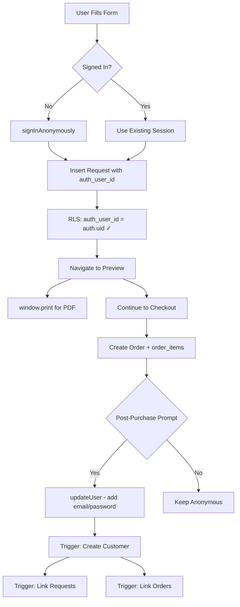

# Custom Itinerary Implementation Plan

**Version:** 2.1 (Data Migration Safety + Status Clarification)
**Date:** 2026-01-10 (Updated)
**Status:** Ready for Implementation (Frontend NOT yet implemented)
**Author:** Claude Code Agent

---

## 📋 Table of Contents

1. [Overview](#overview)
2. [Architecture](#architecture)
3. [Database Schema](#database-schema)
4. [Database Migrations](#database-migrations)
5. [Supabase Configuration](#supabase-configuration)
6. [Frontend Implementation](#frontend-implementation)
7. [Admin Panel](#admin-panel)
8. [User Workflows](#user-workflows)
9. [Security & RLS](#security--rls)
10. [Testing](#testing)
11. [Deployment](#deployment)
12. [Critical Fixes Applied](#critical-fixes-applied)

---

## Overview

### Goal
Implementovat systém pro custom itinerary requests s:
- ✅ Guest checkout (anonymous authentication)
- ✅ HTML Preview s možností stažení PDF (window.print())
- ✅ Propojení request → order přes order_items
- ✅ Post-purchase account creation
- ✅ Automatická synchronizace customer lifecycle

### Key Technologies
- **Auth:** Supabase Anonymous Sign-In (not `anon` role!)
- **PDF:** HTML + @media print CSS + window.print()
- **CAPTCHA:** Cloudflare Turnstile (invisible mode)
- **Security:** PostgreSQL RLS with `auth_user_id` pattern

---

## Architecture

### Data Flow Overview



### Database Relationship Diagram

```
auth.users (Supabase Managed)
├─ id: UUID
├─ email: text (NULL for anonymous)
├─ is_anonymous: boolean
│
├──► customers (Public Schema)
│    ├─ id: UUID (= auth.users.id via trigger)
│    ├─ email: text
│    ├─ name: text
│    │
│    └──► custom_itinerary_requests
│         ├─ id: UUID
│         ├─ auth_user_id: UUID → auth.users.id ✅ (RLS key!)
│         ├─ customer_id: UUID → customers.id (NULL initially)
│         ├─ customer_email: text
│         ├─ form_data: JSONB
│         │
│         └──► order_items
│              ├─ order_id: UUID
│              ├─ product_id: UUID
│              └─ custom_itinerary_request_id: UUID ✅
```

---

## Database Schema

### Key Tables

#### `custom_itinerary_requests`

| Column | Type | Description |
|--------|------|-------------|
| `id` | UUID | Primary key |
| `auth_user_id` | UUID | **FK to auth.users.id** (for RLS) ✅ |
| `customer_id` | UUID | FK to customers.id (NULL for guests) |
| `customer_email` | text | Denormalized for queries |
| `customer_name` | text | Denormalized for queries |
| `form_data` | JSONB | Complete form submission |
| `status` | text | new, in_progress, completed, cancelled |
| `consultation_notes` | text | Admin notes |
| `created_at` | timestamptz | Auto timestamp |
| `updated_at` | timestamptz | Auto timestamp |

#### Critical Indexes

```sql
-- For RLS performance (CRITICAL!)
CREATE INDEX idx_custom_requests_auth_user_id
  ON custom_itinerary_requests(auth_user_id);

-- For JOIN performance
CREATE INDEX idx_order_items_custom_request_id
  ON order_items(custom_itinerary_request_id)
  WHERE custom_itinerary_request_id IS NOT NULL;

-- For JSONB queries
CREATE INDEX idx_custom_requests_form_data
  ON custom_itinerary_requests USING GIN(form_data);
```

---

## Database Migrations

### Migration Execution Order

```bash
# MUST run in this order!
supabase migration up 011_link_custom_requests_to_orders
supabase migration up 012_custom_requests_rls
supabase migration up 013_customers_auth_sync
```

### 011: Link Custom Requests to Orders

**File:** `supabase/migrations/011_link_custom_requests_to_orders.sql`

**Changes:**
- Adds `custom_itinerary_request_id` column to `order_items`
- Creates index for JOIN performance
- Creates "Itinerář na míru" product (slug: `itinerar-na-miru`)

### 012: Custom Requests RLS (CORRECTED)

**File:** `supabase/migrations/012_custom_requests_rls.sql`

**CRITICAL FIX:**
- ✅ Adds `auth_user_id` column (FK to `auth.users.id`)
- ✅ RLS policies use `auth_user_id = auth.uid()` (NOT `customer_id`!)
- ✅ Works for both anonymous and permanent users

**RLS Policies Created:**
1. INSERT: Authenticated users (including anonymous)
2. SELECT: Users see only their own requests
3. UPDATE: Only permanent users (not anonymous)
4. ALL: Admins have full access
5. RESTRICTIVE: Anon role blocked

**Why This Fix is Critical:**

```sql
-- ❌ WRONG (original plan):
USING (customer_id = auth.uid())
-- customer_id = UUID from customers.id
-- auth.uid() = UUID from auth.users.id
-- These are DIFFERENT UUIDs! ❌

-- ✅ CORRECT (fixed version):
USING (auth_user_id = auth.uid())
-- auth_user_id = UUID from auth.users.id
-- auth.uid() = UUID from auth.users.id
-- These MATCH! ✅
```

### 013: Customer Auth Sync (NEW)

**File:** `supabase/migrations/013_customers_auth_sync.sql`

⚠️ **PREREQUISITE:** This migration assumes `customers` table is empty or contains only test data. See [Sprint 1](#sprint-1-database-migrations) for prerequisite checks.

**Automated Customer Lifecycle:**

| Event | Trigger | Action |
|-------|---------|--------|
| Permanent user signs up | `on_auth_user_created` | Create customer record |
| Anonymous adds email | `on_auth_user_email_set` | Create customer record |
| Customer created | `on_customer_created` | Link existing requests |
| Customer created | `on_customer_created_link_orders` | Link existing orders |

**All Functions use `SECURITY DEFINER`** (allows auth schema to write to public schema)

**Data Migration Safety:**
- Migration includes automatic check for existing customers
- Warns if data exists (to prevent UUID pattern inconsistency)
- For production databases with data: Contact dev team before running

---

## Supabase Configuration

### Authentication Settings

**Path:** Settings → Authentication → General

```yaml
Anonymous Sign-Ins: ON ✅
Email Confirmation:
  - Development: OFF (faster testing)
  - Production: ON (more secure)
Password Requirements:
  - Minimum: 6 characters (default)
  - Recommended: 8+ for production
```

### Bot Protection (MANDATORY)

**Path:** Settings → Authentication → Bot Protection

```yaml
CAPTCHA Provider: Cloudflare Turnstile
  Site Key: [from Cloudflare Dashboard]
  Secret Key: [from Cloudflare Dashboard]
  Widget Mode: Invisible

Rate Limiting:
  Anonymous sign-ins: 30/hour per IP
  Email sign-ups: 5/hour per IP
```

### Cloudflare Turnstile Setup

1. **Create site:** https://dash.cloudflare.com/ → Turnstile
2. **Configure:**
   - Widget Mode: **Invisible**
   - Domain: `your-domain.cz`
3. **Get keys:**
   - **Site Key** → Frontend (.env.local)
   - **Secret Key** → Supabase Dashboard

### Environment Variables

**`.env.local` (Frontend):**

```bash
# Supabase
VITE_SUPABASE_URL=https://your-project.supabase.co
VITE_SUPABASE_ANON_KEY=your-anon-key

# Cloudflare Turnstile (PUBLIC - safe in frontend)
VITE_TURNSTILE_SITE_KEY=0x4AAAAAAAxxx...

# ⚠️ NEVER add Secret Key to frontend!
```

### Admin Role Setup

**Path:** Authentication → Users → [Select User] → User Metadata

Set `app_metadata`:

```json
{
  "role": "admin"
}
```

---

## Frontend Implementation

⚠️ **IMPLEMENTATION STATUS: NOT YET IMPLEMENTED** ⚠️

**Current State:**
- Frontend components ([CustomItineraryForm.jsx](../src/pages/CustomItineraryForm.jsx)) still use **OLD implementation** with:
  - ❌ jsPDF (instead of window.print())
  - ❌ No Supabase integration
  - ❌ No anonymous authentication
  - ❌ No database storage
  - ❌ No `auth_user_id` field usage

**This Section:**
- 📋 Documents the **PLANNED** implementation
- 🎯 Serves as implementation guide for Sprint 2
- ✅ All patterns validated against Supabase 2026 best practices

**To Implement:**
See [Sprint 2: Frontend Implementation](#sprint-2-frontend-implementation) for step-by-step guide.

---

### Dependencies

```bash
npm install @marsidev/react-turnstile
```

### File Structure

```
src/
├── pages/
│   ├── CustomItineraryForm.jsx (MODIFIED)
│   ├── CustomItineraryPreview.jsx (NEW)
│   └── CustomItineraryPreview.css (NEW)
├── components/
│   └── PostPurchaseAccountPrompt.jsx (NEW)
└── App.jsx (add routes)
```

### Routes Configuration

```jsx
// App.jsx
<Route path="/itinerar-na-miru" element={<CustomItineraryForm />} />
<Route path="/itinerar-na-miru/preview/:id" element={<CustomItineraryPreview />} />
```

### Key Implementation Points

#### CustomItineraryForm.jsx

**Critical Changes:**

1. ✅ Check existing session before `signInAnonymously()`
2. ✅ Add Turnstile CAPTCHA widget
3. ✅ Insert with `auth_user_id` (NOT `customer_id`)
4. ✅ Simple navigation (NO `useTransition`)
5. ✅ Proper error handling

**Code Pattern:**

```jsx
// ✅ STEP 1: Check if already signed in
const { data: { user: existingUser } } = await supabase.auth.getUser();

// ✅ STEP 2: Sign in anonymously only if needed
if (!existingUser) {
  await supabase.auth.signInAnonymously({
    options: { captchaToken }
  });
}

// ✅ STEP 3: Insert with auth_user_id
const requestData = {
  auth_user_id: authUser.id,  // ✅ CORRECT
  customer_id: null,          // ✅ NULL initially
  // ...
};
```

#### CustomItineraryPreview.jsx

**Features:**

1. ✅ Fetch request via RLS (user sees only their own)
2. ✅ Print button → `window.print()`
3. ✅ Continue to checkout button
4. ✅ @media print CSS for PDF formatting

**Print CSS Pattern:**

```css
@media print {
  .no-print { display: none !important; }

  @page {
    margin: 2cm;
    size: A4;
  }

  body {
    font-family: Georgia, 'Times New Roman', serif;
    font-size: 12pt;
  }

  h2 { page-break-after: avoid; }
  section { page-break-inside: avoid; }
}
```

#### PostPurchaseAccountPrompt.jsx

**Features:**

1. ✅ Password validation (min 6 chars)
2. ✅ Error handling for duplicate email
3. ✅ Success state with email verification message
4. ✅ Optional skip ("Ne, děkuji")

**Code Pattern:**

```jsx
await supabase.auth.updateUser({
  email: orderData.customer_email,
  password: password,
  data: { name: orderData.customer_name }
});

// Triggers automatically:
// 1. handle_user_email_update() → Create customer
// 2. link_requests_to_customer() → Link requests
// 3. link_orders_to_customer() → Link orders
```

---

## Admin Panel

### Resources to Create

```
src/resources/customItineraryRequests/
├── CustomItineraryRequestList.tsx
└── CustomItineraryRequestEdit.tsx
```

### List Component Features

- Display: name, email, destination, budget, status, created_at
- Filter by status
- Sort by created_at DESC
- Row click → edit

### Edit Component Features

- View all form_data (formatted JSON)
- Update status (dropdown)
- Add consultation_notes (textarea)
- View metadata (created_at, updated_at)

### Register Resource

```tsx
// App.tsx (admin)
<Resource
  name="custom_itinerary_requests"
  list={CustomItineraryRequestList}
  edit={CustomItineraryRequestEdit}
  icon={AssignmentIcon}
  options={{ label: 'Itineráře na míru' }}
/>
```

---

## User Workflows

### Workflow 1: Anonymous Guest Checkout

```
1. User visits /itinerar-na-miru
2. Fills form (not signed in)
3. Submits → signInAnonymously()
   - auth.users: { id: abc-123, is_anonymous: true }
   - customers: (NO RECORD)
4. Insert request:
   - auth_user_id: abc-123 ✅
   - customer_id: NULL ✅
5. Navigate to preview/:id
   - RLS: ✅ Works (auth_user_id = auth.uid())
6. Download PDF (window.print())
7. Continue to checkout
   - Create order
   - order_items.custom_itinerary_request_id = abc-123 ✅
8. Post-purchase prompt → Create account
   - updateUser({ email, password })
   - Trigger: Create customer (id: abc-123)
   - Trigger: Link requests (customer_id: abc-123)
   - Trigger: Link orders (customer_id: abc-123)
```

### Workflow 2: Registered User

```
1. User signs up normally
   - auth.users: { id: xyz-789, is_anonymous: false }
   - Trigger: Create customer (id: xyz-789) ✅
2. Fills custom itinerary form (already signed in)
   - Skip signInAnonymously()
3. Insert request:
   - auth_user_id: xyz-789 ✅
   - customer_id: xyz-789 ✅ (already linked)
4. Preview & checkout (same flow)
```

---

## Security & RLS

### RLS Policy Pattern

```sql
-- ✅ CORRECT: Uses auth_user_id
CREATE POLICY "Users can view their own requests"
  ON custom_itinerary_requests
  FOR SELECT
  TO authenticated
  USING (auth_user_id = auth.uid());
```

**Why This Works:**

| User Type | auth.uid() | auth_user_id | Match? |
|-----------|------------|--------------|--------|
| Anonymous | abc-123 | abc-123 | ✅ YES |
| Permanent | xyz-789 | xyz-789 | ✅ YES |

**Why customer_id Doesn't Work:**

| User Type | auth.uid() | customer_id | Match? |
|-----------|------------|-------------|--------|
| Anonymous | abc-123 | NULL | ❌ NO |
| Permanent | xyz-789 | xyz-789 | ✅ YES |

### Security Checklist

```
✅ RLS enabled on custom_itinerary_requests
✅ Policies use auth_user_id = auth.uid()
✅ CAPTCHA enabled (Cloudflare Turnstile)
✅ Rate limiting (30/hour per IP)
✅ Admin role from app_metadata
✅ Indexes on auth_user_id (RLS performance)
✅ ON DELETE CASCADE for auth_user_id
✅ Triggers are SECURITY DEFINER
✅ HTTPS only (Supabase default)
⚠️  Monitor anonymous user creation
⚠️  Set up error tracking (Sentry)
```

---

## Testing

### Test Cases

#### ✅ Test 1: Anonymous User - Create Request
- Navigate to /itinerar-na-miru
- Fill form WITHOUT signing in
- Submit form
- Verify CAPTCHA works
- **Expected:** Request created, preview shown

#### ✅ Test 2: Anonymous User - View Own Request
- Stay in same browser (session preserved)
- Try to view preview/:id
- **Expected:** Can view own request

#### ✅ Test 3: Anonymous User - Cannot View Others
- Open incognito window
- Try to access preview/:id from Test 1
- **Expected:** "Nemáte přístup" error

#### ✅ Test 4: Anonymous User - Checkout
- Click "Pokračovat na objednávku"
- Complete Stripe payment
- **Expected:** order_items has custom_itinerary_request_id

#### ✅ Test 5: Post-Purchase Account Creation
- See PostPurchaseAccountPrompt after checkout
- Enter password, submit
- **Expected:** Customer created, requests linked, orders linked

#### ✅ Test 6: Registered User - Create Request
- Sign up normally (not anonymous)
- Fill custom itinerary form
- **Expected:** customer_id populated immediately

#### ✅ Test 7: CAPTCHA Failure
- Block Turnstile script
- Try to submit form
- **Expected:** "CAPTCHA verification required" error

#### ✅ Test 8: RLS Admin Access
- Set user app_metadata: { role: "admin" }
- Try to view all requests
- **Expected:** Admin sees all requests

#### ✅ Test 9: Print/PDF Download
- Open preview
- Click "Stáhnout PDF"
- **Expected:** Clean PDF with A4 format, proper fonts

#### ✅ Test 10: React Admin Panel
- Login as admin
- Navigate to "Itineráře na míru"
- **Expected:** Full CRUD works

---

## Deployment

### Sprint-Based Implementation

#### Sprint 0: Infrastructure (MUST DO FIRST!)

1. **Cloudflare Turnstile:**
   - Visit: https://dash.cloudflare.com/
   - Create site, get Site Key + Secret Key

2. **Supabase Dashboard:**
   - Enable Anonymous Sign-Ins
   - Configure CAPTCHA (paste Secret Key)
   - Set Email Confirmation preference
   - Configure Rate Limits

3. **Environment Variables:**
   - Add to .env.local: `VITE_TURNSTILE_SITE_KEY`

#### Sprint 1: Database Migrations

⚠️ **PREREQUISITE CHECK - Migration 013** ⚠️

Migration 013 modifies `customers` table ID pattern. Before running:

**For Fresh Installations (empty customers table):**
```bash
# ✅ Safe to proceed directly
```

**For Existing Production Data:**
```sql
-- ❌ STOP! Check customer count first:
SELECT COUNT(*) FROM customers;

-- If count > 0:
-- 1. Backup customers table
CREATE TABLE customers_backup AS SELECT * FROM customers;

-- 2. For TEST environments only - clear data:
TRUNCATE customers CASCADE;

-- 3. For PRODUCTION - contact dev team for custom migration
```

**Run Migrations:**

```bash
cd /Users/janparma/Desktop/Projekty/cesty-bez-mapy

supabase migration up 011_link_custom_requests_to_orders
supabase migration up 012_custom_requests_rls
supabase migration up 013_customers_auth_sync

# ⚠️ Watch for warnings in migration 013 output!
# If you see warnings about existing customers, review them carefully.

# Verify:
# - custom_itinerary_requests has auth_user_id column
# - RLS policies enabled
# - Triggers created
# - No ERROR messages in output
```

#### Sprint 2: Frontend Implementation

```bash
npm install @marsidev/react-turnstile

# Create files:
# 1. Modify: CustomItineraryForm.jsx
# 2. Create: CustomItineraryPreview.jsx + .css
# 3. Create: PostPurchaseAccountPrompt.jsx
# 4. Modify: App.jsx (routes)
```

#### Sprint 3: Admin Panel

```bash
cd /Users/janparma/Desktop/Projekty/cesty-bez-mapy-admin

# Create:
# 1. CustomItineraryRequestList.tsx
# 2. CustomItineraryRequestEdit.tsx
# 3. Update App.tsx (register resource)
```

#### Sprint 4: Testing

- Run all 10 test cases
- Fix bugs
- Monitor Supabase logs

#### Sprint 5: Production Deploy

1. Build: `npm run build`
2. Deploy to hosting (Vercel/Netlify)
3. Update Cloudflare Turnstile domain
4. Enable Email Confirmation in Supabase
5. Monitor analytics and errors

---

## Critical Fixes Applied

### What Was Wrong in Original Plan

| Issue | Original | Fixed |
|-------|----------|-------|
| **RLS Policy** | `customer_id = auth.uid()` | `auth_user_id = auth.uid()` |
| **Schema** | Missing `auth_user_id` | Added `auth_user_id` column |
| **Customer Sync** | Manual | Automated via triggers |
| **Guest Checkout** | Non-functional | Fully functional |
| **Anonymous Upgrade** | Not addressed | Automatic via updateUser() |

### Why Original Plan Failed

```sql
-- ❌ PROBLEM:
-- customer_id references customers.id (own generated UUID)
-- auth.uid() returns auth.users.id (Supabase Auth UUID)
-- These are DIFFERENT UUIDs!

CREATE POLICY "broken_policy"
  ON custom_itinerary_requests
  USING (customer_id = auth.uid());  -- Never matches!

-- ✅ SOLUTION:
-- Add auth_user_id that references auth.users.id
-- Now RLS can compare auth_user_id with auth.uid()

CREATE POLICY "working_policy"
  ON custom_itinerary_requests
  USING (auth_user_id = auth.uid());  -- Always matches!
```

### Audit Findings Implemented

1. ✅ **CRITICAL:** Schema mismatch fixed with `auth_user_id`
2. ✅ **HIGH:** Customer lifecycle automated with triggers
3. ✅ **MEDIUM:** PostPurchaseAccountPrompt error handling improved
4. ✅ **MEDIUM:** Complete Supabase Dashboard configuration guide
5. ✅ **LOW:** Environment variables documented

### Audit 2026-01-10 Findings

**Problem #1: Data Migration Assumption (MEDIUM)**
- ✅ **FIXED:** Added prerequisite check to migration 013
- ✅ **FIXED:** Added warnings for existing customer data
- ✅ **FIXED:** Documented backup procedures in Sprint 1
- Status: Migration now includes automatic data check + warnings

**Problem #2: Frontend Implementation Status (INFORMATIONAL)**
- ⚠️ **CLARIFIED:** Frontend components NOT yet implemented
- ⚠️ **CLARIFIED:** Current code uses old jsPDF pattern
- ✅ **DOCUMENTED:** Implementation status warning in "Frontend Implementation" section
- Status: Documentation now clearly states this is an implementation plan, not completed work

---

## References

- **Migrations:** `/supabase/migrations/011*.sql`, `012*.sql`, `013*.sql`
- **Architecture Decisions:** See `ARCHITECTURE_DECISIONS.md`
- **User Workflows:** See `WORKFLOWS.md` (with diagrams)
- **Supabase Docs:** https://supabase.com/docs/guides/auth/managing-user-data
- **Cloudflare Turnstile:** https://developers.cloudflare.com/turnstile/

---

**Last Updated:** 2026-01-10
**Next Review:** After Sprint 4 (Testing)
