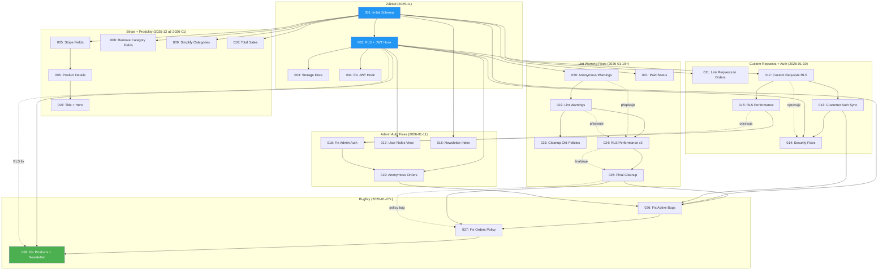
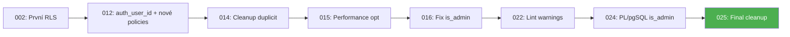

# Cesty bez mapy - Dokumentace migrací

> **Verze:** 1.0
> **Datum vytvoření:** 2026-01-23
> **Autor:** Automaticky generováno
> **Celkem migrací:** 28

---

## Obsah

1. [Přehled](#1-přehled)
2. [Seznam migrací](#2-seznam-migrací)
3. [Graf závislostí](#3-graf-závislostí)
4. [Aktuální schéma databáze](#4-aktuální-schéma-databáze)
5. [RLS Policies](#5-rls-policies)
6. [Triggery a funkce](#6-triggery-a-funkce)
7. [Indexy](#7-indexy)
8. [Konvence pro nové migrace](#8-konvence-pro-nové-migrace)
9. [Identifikované problémy](#9-identifikované-problémy)
10. [Doporučení](#10-doporučení)

---

## 1. Přehled

### Statistiky

| Metrika | Hodnota |
|---------|---------|
| Celkem migrací | 28 |
| Období | 2025-11-04 až 2026-01-29 |
| Tabulky (public) | 11 |
| Storage buckety | 3 |
| RLS policies | ~50 |
| Triggery | 10+ |
| Funkce | 10+ |
| Indexy | 35+ |

### Typy migrací

| Typ | Počet | Popis |
|-----|-------|-------|
| SCHEMA | 9 | Změny struktury tabulek (sloupce, constraints) |
| RLS | 9 | Row Level Security policies |
| TRIGGER | 3 | Triggery a funkce |
| INDEX | 1 | Optimalizační indexy |
| FIX | 9 | Opravy chyb a hotfixy |
| CLEANUP | 4 | Úklid duplicit a legacy kódu |
| DOC | 1 | Pouze dokumentace |

---

## 2. Seznam migrací

| # | Název | Datum | Typ | Dotčené tabulky | Stav |
|---|-------|-------|-----|-----------------|------|
| 001 | initial_schema | 2025-11-04 | SCHEMA | customers, categories, products, product_categories, blog_posts, orders, order_items, custom_itinerary_requests, download_tokens, integration_logs, newsletter_consent_log | ✅ OK |
| 002 | rls_with_jwt_hook | 2025-11-05 | RLS | user_roles, všechny tabulky | ⚠️ Částečně přepsáno |
| 003 | storage_buckets_DOCUMENTATION_ONLY | 2025-11-09 | DOC | storage.objects | ⚠️ Nelze spustit SQL |
| 004 | fix_custom_access_token_hook | 2025-11-09 | FIX | - (funkce) | ✅ OK |
| 005 | add_stripe_fields_to_products | 2025-12-07 | SCHEMA | products | ✅ OK |
| 006 | add_product_detail_fields | 2026-01-02 | SCHEMA | products | ⚠️ hero_content odstraněn v 007 |
| 007 | add_title_and_hero_fields | 2026-01-02 | SCHEMA | products | ✅ OK |
| 008 | remove_unused_category_fields | 2026-01-03 | SCHEMA | categories | ✅ OK |
| 009 | simplify_product_categories | 2026-01-03 | SCHEMA | products, product_categories (DROP) | ✅ OK |
| 010 | add_total_sales_to_products | 2026-01-03 | SCHEMA, TRIGGER | products, order_items, orders | ✅ OK |
| 011 | link_custom_requests_to_orders | 2026-01-10 | SCHEMA | order_items, products | ✅ OK (+ seed data: INSERT "Itinerář na míru") |
| 012 | custom_requests_rls | 2026-01-10 | SCHEMA, RLS | custom_itinerary_requests | ⚠️ Policies přepsány |
| 013 | customers_auth_sync | 2026-01-10 | TRIGGER | customers, auth.users | ⚠️ Merge s 002 v 014 |
| 014 | security_fixes_and_policy_cleanup | 2026-01-10 | FIX, CLEANUP | všechny | ✅ OK |
| 015 | rls_performance_optimization | 2026-01-10 | RLS | custom_itinerary_requests | ⚠️ Přepsáno |
| 016 | fix_custom_requests_admin_auth | 2026-01-11 | FIX | custom_itinerary_requests | ⚠️ Přepsáno |
| 017 | user_roles_view_own | 2026-01-11 | RLS | user_roles | ⚠️ Přepsáno |
| 018 | newsletter_consent_performance_index | 2026-01-11 | INDEX | newsletter_consent_log | ✅ OK |
| 019 | enable_anonymous_orders | 2026-01-11 | SCHEMA, RLS | orders, order_items | ⚠️ Přepsáno |
| 020 | fix_anonymous_access_warnings | 2026-01-19 | FIX | storage.objects, is_admin() | ⚠️ Přepsáno v 024 |
| 021 | add_paid_status | ? | SCHEMA | custom_itinerary_requests | ⚠️ Chybí hlavička |
| 022 | fix_anonymous_lint_warnings | 2026-01-21 | RLS | všechny | ⚠️ Přepsáno v 024 |
| 023 | cleanup_old_policies | 2026-01-21 | CLEANUP | orders, order_items, storage.objects | ✅ OK |
| 024 | fix_rls_performance | 2026-01-22 | FIX, RLS | všechny, is_admin(), is_permanent_user() | ✅ OK |
| 025 | cleanup_duplicate_policies | 2026-01-23 | CLEANUP | všechny | ✅ OK |
| 026 | fix_active_bugs_and_cleanup | 2026-01-27 | FIX, CLEANUP | orders, customers | ✅ OK ⚠️ pg_cron/FK |
| 027 | fix_orders_insert_policy | 2026-01-28 | FIX | orders | ✅ OK |
| 028 | fix_products_and_newsletter_policies | 2026-01-29 | FIX, RLS | products, newsletter_consent_log | ✅ OK |

### Legenda stavů

- ✅ **OK** - Migrace je platná a aktuální
- ✅ ⚠️ **OK s podmínkami** - Migrace projde, ale některé části závisí na podmínkách (tier, data)
- ⚠️ **Částečně přepsáno** - Některé části byly přepsány pozdějšími migracemi
- ⚠️ **Přepsáno** - Celá logika byla nahrazena pozdější migrací
- ⚠️ **Chybí hlavička** - Migrace nemá standardní formát

---

## 3. Graf závislostí



### Řetězec oprav custom_itinerary_requests policies



---

## 4. Aktuální schéma databáze

### ERD Diagram

```mermaid
erDiagram
    customers {
        uuid id PK "FK auth.users(id) ON DELETE CASCADE, no DEFAULT"
        text email UK
        text name
        text phone
        text ecomail_subscriber_id
        numeric total_spent
        timestamptz last_purchase_at
        timestamptz created_at
        timestamptz updated_at
    }

    products {
        uuid id PK
        text title
        text description
        numeric price
        text duration
        text badge
        text pdf_url
        text image_url
        text slug UK
        text seo_title
        text seo_description
        numeric vat_rate
        jsonb quiz_data
        boolean is_active
        boolean is_deleted
        timestamptz deleted_at
        text stripe_product_id
        text stripe_price_id
        integer budget_level "1-3"
        text spring_description
        text summer_description
        text autumn_description
        text winter_description
        jsonb gallery_images
        numeric average_rating "0-5"
        integer review_count
        text detail_title
        text hero_subtitle
        text hero_line_1
        text hero_line_2
        text hero_line_3
        text hero_line_4
        integer total_sales
        uuid[] category_ids
        timestamptz created_at
        timestamptz updated_at
    }

    categories {
        uuid id PK
        text name
        text slug UK
        timestamptz created_at
        timestamptz updated_at
    }
    %% Pozn: categories původně obsahovaly description, parent_id (001), odstraněny v 008

    orders {
        uuid id PK
        uuid customer_id FK
        uuid auth_user_id FK "auth.users"
        text customer_email "NOT NULL"
        text customer_name "nullable pro anonymous checkout"
        numeric total_amount "NOT NULL, >= 0"
        text stripe_payment_id UK "nullable pro pre-payment orders"
        text status "pending|completed|failed|refunded"
        text facturoid_invoice_id
        text facturoid_invoice_number
        boolean invoice_sent
        boolean ecomail_synced
        timestamptz created_at
        timestamptz updated_at
    }

    order_items {
        uuid id PK
        uuid order_id FK
        uuid product_id FK
        uuid custom_itinerary_request_id FK
        integer quantity
        numeric price_at_purchase
        numeric vat_rate_at_purchase
        timestamptz created_at
    }

    custom_itinerary_requests {
        uuid id PK
        uuid customer_id FK
        uuid auth_user_id FK "auth.users"
        text customer_email
        text customer_name
        jsonb form_data
        text status "new|paid|in_progress|completed|cancelled"
        text consultation_notes
        timestamptz created_at
        timestamptz updated_at
    }

    blog_posts {
        uuid id PK
        text title
        text content
        text excerpt
        text image_url
        text slug UK
        text seo_title
        text seo_description
        timestamptz published_at
        timestamptz created_at
        timestamptz updated_at
    }

    download_tokens {
        uuid id PK
        uuid order_id FK
        text token UK
        timestamptz expires_at
        timestamptz created_at
    }

    integration_logs {
        uuid id PK
        text service "ecomail|facturoid|stripe|other"
        text action
        text status "success|failed|pending"
        text error_message
        jsonb metadata
        timestamptz created_at
    }

    newsletter_consent_log {
        uuid id PK
        text email
        boolean consent_given
        text source
        inet ip_address
        text user_agent
        text privacy_policy_version
        timestamptz created_at
    }

    user_roles {
        uuid id PK
        uuid user_id FK UK "auth.users"
        text role "admin|user"
        timestamptz created_at
    }

    %% Relace
    customers ||--o{ orders : "has"
    customers ||--o{ custom_itinerary_requests : "submits"
    orders ||--|{ order_items : "contains"
    products ||--o{ order_items : "sold_as"
    orders ||--o{ download_tokens : "generates"
    custom_itinerary_requests ||--o| order_items : "linked_to"
```

### Storage Buckety

| Bucket | Public | Limit | MIME typy | Účel |
|--------|--------|-------|-----------|------|
| `products-pdfs` | ❌ | 200 MB | application/pdf | PDF průvodci (signed URLs) |
| `products-images` | ✅ | 10 MB | image/jpeg, png, webp | Obrázky produktů |
| `blog-images` | ✅ | 10 MB | image/jpeg, png, webp | Obrázky k článkům |

---

## 5. RLS Policies

### Přehled podle tabulek (po migraci 028)

#### `products`

| Policy | Operace | Role | Podmínka |
|--------|---------|------|----------|
| products_public_select | SELECT | anon, authenticated | is_deleted = false |
| products_admin_insert | INSERT | authenticated | is_admin() |
| products_admin_update | UPDATE | authenticated | is_admin() |
| products_admin_delete | DELETE | authenticated | is_admin() |

> **Pozn:** SELECT policy filtruje soft-deleted produkty (is_deleted = false). Admini vidí všechny produkty přes admin policies. Opraveno v migraci 028.

#### `blog_posts`

| Policy | Operace | Role | Podmínka |
|--------|---------|------|----------|
| blog_posts_public_select | SELECT | anon | published_at IS NOT NULL |
| blog_posts_authenticated_select | SELECT | authenticated | published_at IS NOT NULL OR is_admin() |
| blog_posts_admin_insert | INSERT | authenticated | is_admin() |
| blog_posts_admin_update | UPDATE | authenticated | is_admin() |
| blog_posts_admin_delete | DELETE | authenticated | is_admin() |

#### `categories`

| Policy | Operace | Role | Podmínka |
|--------|---------|------|----------|
| categories_public_select | SELECT | anon, authenticated | true |
| categories_admin_insert | INSERT | authenticated | is_admin() |
| categories_admin_update | UPDATE | authenticated | is_admin() |
| categories_admin_delete | DELETE | authenticated | is_admin() |

#### `customers`

| Policy | Operace | Role | Podmínka |
|--------|---------|------|----------|
| customers_admin_select | SELECT | authenticated | is_admin() |
| customers_admin_insert | INSERT | authenticated | is_admin() |
| customers_admin_update | UPDATE | authenticated | is_admin() |
| customers_admin_delete | DELETE | authenticated | is_admin() |

#### `orders`

| Policy | Operace | Role | Podmínka |
|--------|---------|------|----------|
| Users and admins can insert orders | INSERT | authenticated | (own auth_user_id + customer_email NOT NULL + total_amount >= 0) OR is_admin() |
| Users and admins can select orders | SELECT | authenticated | own auth_user_id OR is_admin() |
| Admins can update orders | UPDATE | authenticated | is_admin() |
| Admins can delete orders | DELETE | authenticated | is_admin() |

> **Pozn:** INSERT policy validuje customer_email a total_amount. customer_name je volitelný (nullable od migrace 026, policy od 027).

#### `order_items`

| Policy | Operace | Role | Podmínka |
|--------|---------|------|----------|
| Users and admins can insert order_items | INSERT | authenticated | EXISTS own order OR is_admin() |
| Users and admins can select order_items | SELECT | authenticated | EXISTS own order OR is_admin() |
| Admins can update order_items | UPDATE | authenticated | is_admin() |
| Admins can delete order_items | DELETE | authenticated | is_admin() |

#### `custom_itinerary_requests`

| Policy | Operace | Role | Podmínka |
|--------|---------|------|----------|
| Users and admins can insert requests | INSERT | authenticated | own auth_user_id OR is_admin() |
| Users and admins can select requests | SELECT | authenticated | own auth_user_id OR is_admin() |
| Users and admins can update requests | UPDATE | authenticated | (own + permanent) OR is_admin() |
| Admins can delete requests | DELETE | authenticated | is_admin() |

#### `download_tokens`

| Policy | Operace | Role | Podmínka |
|--------|---------|------|----------|
| download_tokens_public_select | SELECT | anon | expires_at > now() |
| download_tokens_authenticated_select | SELECT | authenticated | expires_at > now() OR is_admin() |
| download_tokens_admin_insert | INSERT | authenticated | is_admin() |
| download_tokens_admin_delete | DELETE | authenticated | is_admin() |

#### `integration_logs`

| Policy | Operace | Role | Podmínka |
|--------|---------|------|----------|
| integration_logs_admin_select | SELECT | authenticated | is_admin() |
| integration_logs_admin_insert | INSERT | authenticated | is_admin() |
| integration_logs_admin_delete | DELETE | authenticated | is_admin() |

#### `newsletter_consent_log`

| Policy | Operace | Role | Podmínka |
|--------|---------|------|----------|
| newsletter_consent_public_insert | INSERT | anon, authenticated | email + consent_given + source NOT NULL |
| newsletter_consent_admin_select | SELECT | authenticated | is_admin() |

> **Pozn:** INSERT policy validuje povinná pole (email, consent_given, source). Defense in depth přidáno v migraci 028.

#### `user_roles`

| Policy | Operace | Role | Podmínka |
|--------|---------|------|----------|
| auth_admin_read_user_roles | SELECT | supabase_auth_admin | true (pro JWT hook) |
| user_roles_select | SELECT | authenticated | own user_id OR is_admin() |
| user_roles_admin_insert | INSERT | authenticated | is_admin() |
| user_roles_admin_update | UPDATE | authenticated | is_admin() |
| user_roles_admin_delete | DELETE | authenticated | is_admin() |

### Storage policies (`storage.objects`)

| Bucket | Policy | Operace | Podmínka |
|--------|--------|---------|----------|
| blog-images | blog_images_admin_insert | INSERT | is_admin() |
| blog-images | blog_images_admin_update | UPDATE | is_admin() |
| blog-images | blog_images_admin_delete | DELETE | is_admin() |
| products-images | products_images_admin_insert | INSERT | is_admin() |
| products-images | products_images_admin_update | UPDATE | is_admin() |
| products-images | products_images_admin_delete | DELETE | is_admin() |
| products-pdfs | products_pdfs_admin_insert | INSERT | is_admin() |
| products-pdfs | products_pdfs_admin_update | UPDATE | is_admin() |
| products-pdfs | products_pdfs_admin_delete | DELETE | is_admin() |
| products-pdfs | products_pdfs_admin_select | SELECT | is_admin() |

---

## 6. Triggery a funkce

### Helper funkce

#### `is_admin()`

```sql
-- Definice (migrace 024)
CREATE OR REPLACE FUNCTION is_admin()
RETURNS boolean
LANGUAGE plpgsql
STABLE
SET search_path = ''
AS $$
DECLARE
  jwt_data jsonb;
BEGIN
  jwt_data := (SELECT auth.jwt());
  RETURN
    COALESCE((jwt_data->>'is_admin')::boolean, false)
    AND
    (jwt_data->>'is_anonymous')::boolean IS FALSE;
END;
$$;
```

**Účel:** Kontroluje, zda je aktuální uživatel admin a není anonymní. Používá cache JWT pro performance.

#### `is_permanent_user()`

```sql
-- Definice (migrace 024)
CREATE OR REPLACE FUNCTION is_permanent_user()
RETURNS boolean
LANGUAGE plpgsql
STABLE
SET search_path = ''
AS $$
DECLARE
  jwt_data jsonb;
BEGIN
  jwt_data := (SELECT auth.jwt());
  RETURN (jwt_data->>'is_anonymous')::boolean IS NOT TRUE;
END;
$$;
```

**Účel:** Kontroluje, zda uživatel není anonymní (má permanentní účet).

#### `cleanup_expired_tokens()`

```sql
-- Definice (migrace 002)
CREATE OR REPLACE FUNCTION cleanup_expired_tokens()
RETURNS void
LANGUAGE plpgsql
SECURITY DEFINER
SET search_path = ''
AS $$
BEGIN
  DELETE FROM download_tokens
  WHERE expires_at < now() - interval '7 days';
END;
$$;
```

**Účel:** Maže expirované download tokeny starší než 7 dní.

**pg_cron job (migrace 026):** Spouští se denně v 03:00 (`cron.schedule('cleanup-expired-tokens', '0 3 * * *', ...)`).

> ⚠️ **Poznámka:** pg_cron vyžaduje **Supabase Pro plan**. Na Free tieru se job neprovede (migrace projde s warningem). Po upgrade na Pro spustit:
> ```sql
> CREATE EXTENSION IF NOT EXISTS pg_cron;
> SELECT cron.schedule('cleanup-expired-tokens', '0 3 * * *', 'SELECT public.cleanup_expired_tokens()');
> ```

#### `handle_new_user()` *(odstraněna v 026)*

Původní funkce z migrace 002, která přiřazovala roli `'user'` novým uživatelům. Nahrazena funkcí `handle_new_permanent_user()` v migraci 013 (trigger `on_auth_user_created` přepojen). Osiřelá funkce dropnuta v migraci 026.

### Custom Access Token Hook

#### `custom_access_token_hook(event jsonb)`

```sql
-- Definice (migrace 004, původně 002)
CREATE OR REPLACE FUNCTION public.custom_access_token_hook(event jsonb)
RETURNS jsonb
LANGUAGE plpgsql
STABLE
SET search_path = ''
AS $$
DECLARE
  claims jsonb;
  is_admin boolean;
BEGIN
  claims := event->'claims';

  SELECT EXISTS (
    SELECT 1 FROM public.user_roles ur
    WHERE ur.user_id = (event->>'user_id')::uuid
    AND ur.role = 'admin'
  ) INTO is_admin;

  claims := jsonb_set(claims, '{is_admin}', to_jsonb(is_admin));
  claims := jsonb_set(claims, '{user_role}',
    to_jsonb(CASE WHEN is_admin THEN 'admin' ELSE 'user' END)
  );

  RETURN jsonb_build_object('claims', claims);
END;
$$;
```

**Účel:** Přidává custom claims (`is_admin`, `user_role`) do JWT tokenu.

**Spouští se:** Při každém přihlášení uživatele (Supabase Auth).

**Důležité:** Změna role vyžaduje odhlášení a nové přihlášení.

**GRANT/REVOKE (migrace 002):**
```sql
GRANT EXECUTE ON FUNCTION public.custom_access_token_hook(jsonb) TO supabase_auth_admin;
GRANT USAGE ON SCHEMA public TO supabase_auth_admin;
GRANT SELECT ON TABLE public.user_roles TO supabase_auth_admin;
REVOKE EXECUTE ON FUNCTION public.custom_access_token_hook(jsonb) FROM authenticated, anon, public;
```

### Auth triggery

| Trigger | Tabulka | Událost | Funkce | Účel |
|---------|---------|---------|--------|------|
| on_auth_user_created | auth.users | AFTER INSERT | handle_new_permanent_user() | Vytvoří customer + přiřadí roli |
| on_auth_user_email_set | auth.users | AFTER UPDATE OF email | handle_user_email_update() | Upgrade anonymous → permanent |

### Customer triggery

| Trigger | Tabulka | Událost | Funkce | Účel |
|---------|---------|---------|--------|------|
| on_customer_created | customers | AFTER INSERT | link_requests_to_customer() | Propojí existující requests |
| on_customer_created_link_orders | customers | AFTER INSERT | link_orders_to_customer() | Propojí existující objednávky |

### Product triggery

| Trigger | Tabulka | Událost | Funkce | Účel |
|---------|---------|---------|--------|------|
| update_total_sales_on_order_item_change | order_items | AFTER INSERT/UPDATE/DELETE | update_product_total_sales() | Aktualizuje total_sales |
| update_total_sales_on_order_status_change | orders | AFTER UPDATE OF status | update_all_products_in_order() | Aktualizuje při změně statusu |

### Updated_at triggery

| Trigger | Tabulka |
|---------|---------|
| handle_customers_updated_at | customers |
| handle_categories_updated_at | categories |
| handle_products_updated_at | products |
| handle_blog_posts_updated_at | blog_posts |
| handle_orders_updated_at | orders |
| handle_custom_requests_updated_at | custom_itinerary_requests |

**Funkce:** `moddatetime(updated_at)` z extensions.

---

## 7. Indexy

### customers

| Index | Sloupce | Typ | Účel |
|-------|---------|-----|------|
| idx_customers_last_purchase_at | last_purchase_at DESC | B-tree | Řazení podle poslední objednávky |

### products

| Index | Sloupce | Typ | Podmínka | Účel |
|-------|---------|-----|----------|------|
| idx_products_slug_unique | slug | UNIQUE | is_deleted = false | Unikátní slug pro aktivní produkty |
| idx_products_created_at | created_at DESC | B-tree | - | Řazení podle data |
| idx_products_quiz_data | quiz_data | GIN | - | JSONB vyhledávání |
| idx_products_is_active | is_active | B-tree | is_active = true | Filtrování aktivních |
| idx_products_is_deleted | is_deleted | B-tree | is_deleted = false | Soft delete filtrování |
| idx_products_deleted_at | deleted_at | B-tree | deleted_at IS NOT NULL | Smazané produkty |
| idx_products_stripe_price_id | stripe_price_id | B-tree | - | Checkout lookup |
| idx_products_stripe_product_id | stripe_product_id | B-tree | - | Webhook sync |
| idx_products_gallery_images | gallery_images | GIN | - | JSONB pole |
| idx_products_average_rating | average_rating DESC | B-tree | - | Řazení podle hodnocení |
| idx_products_total_sales | total_sales DESC | B-tree | - | Řazení podle prodejů |
| idx_products_category_ids | category_ids | GIN | - | Filtrování podle kategorií |

### orders

| Index | Sloupce | Typ | Podmínka | Účel |
|-------|---------|-----|----------|------|
| idx_orders_customer_id | customer_id | B-tree | - | JOIN s customers |
| idx_orders_customer_email | customer_email | B-tree | - | Vyhledávání podle emailu |
| idx_orders_stripe_payment_id | stripe_payment_id | B-tree | - | Webhook lookup |
| idx_orders_status | status | B-tree | - | Filtrování podle stavu |
| idx_orders_created_at | created_at DESC | B-tree | - | Řazení |
| idx_orders_pending | created_at DESC | B-tree | status = 'pending' | Pending objednávky |
| idx_orders_auth_user_id | auth_user_id | B-tree | - | RLS performance |

### order_items

| Index | Sloupce | Typ | Podmínka | Účel |
|-------|---------|-----|----------|------|
| idx_order_items_order_id | order_id | B-tree | - | JOIN s orders |
| idx_order_items_product_id | product_id | B-tree | - | JOIN s products |
| idx_order_items_custom_request_id | custom_itinerary_request_id | B-tree | IS NOT NULL | Custom itineráře |

### custom_itinerary_requests

| Index | Sloupce | Typ | Účel |
|-------|---------|-----|------|
| idx_custom_requests_customer_id | customer_id | B-tree | JOIN s customers |
| idx_custom_requests_customer_email | customer_email | B-tree | Vyhledávání |
| idx_custom_requests_status | status | B-tree | Filtrování |
| idx_custom_requests_created_at | created_at DESC | B-tree | Řazení |
| idx_custom_requests_form_data | form_data | GIN | JSONB vyhledávání |
| idx_custom_requests_auth_user_id | auth_user_id | B-tree | RLS performance |

### blog_posts

| Index | Sloupce | Typ | Účel |
|-------|---------|-----|------|
| idx_blog_posts_published_at | published_at DESC NULLS LAST | B-tree | Publikované články |
| idx_blog_posts_created_at | created_at DESC | B-tree | Řazení |

### download_tokens

| Index | Sloupce | Typ | Účel |
|-------|---------|-----|------|
| idx_download_tokens_token | token | B-tree | Validace tokenů |
| idx_download_tokens_order_id | order_id | B-tree | JOIN s orders |
| idx_download_tokens_expires_at | expires_at | B-tree | Expirace |

### integration_logs

| Index | Sloupce | Typ | Účel |
|-------|---------|-----|------|
| idx_integration_logs_service | service | B-tree | Filtrování podle služby |
| idx_integration_logs_status | status | B-tree | Filtrování podle stavu |
| idx_integration_logs_created_at | created_at DESC | B-tree | Řazení |
| idx_integration_logs_metadata | metadata | GIN | JSONB vyhledávání |

### newsletter_consent_log

| Index | Sloupce | Typ | Podmínka | Účel |
|-------|---------|-----|----------|------|
| idx_newsletter_consent_email | email | B-tree | - | Vyhledávání podle emailu |
| idx_newsletter_consent_created_at | created_at DESC | B-tree | - | Řazení |
| idx_newsletter_consent_active | email, created_at DESC | B-tree | consent_given = true | Aktivní subscribers |

### user_roles

| Index | Sloupce | Typ | Účel |
|-------|---------|-----|------|
| idx_user_roles_user_id | user_id | B-tree | JWT hook lookup |

---

## 8. Konvence pro nové migrace

### Šablona migrace

```sql
-- ================================================
-- Migration XXX: [Název]
-- ================================================
-- Created: YYYY-MM-DD
-- Author: [Jméno]
-- Description: [1-2 věty co migrace dělá]
--
-- Dependencies: [Seznam předchozích migrací, např. 001, 002]
-- Affected tables: [Seznam tabulek]
-- Type: SCHEMA | RLS | TRIGGER | INDEX | FIX | CLEANUP
-- ================================================
-- ISSUE (pokud oprava):
--   [Popis problému který řešíme]
-- ================================================
-- SOLUTION:
--   [Popis řešení]
-- ================================================

-- ================================================
-- PART 1: [Název sekce]
-- ================================================

-- Komentář co děláme
[SQL příkazy]

-- ================================================
-- PART 2: [Název sekce]
-- ================================================

[SQL příkazy]

-- ================================================
-- VERIFICATION (volitelné)
-- ================================================
-- SELECT dotazy pro ověření úspěchu
-- Lze spustit ručně po migraci

-- ================================================
-- ROLLBACK (pokud je to bezpečné)
-- ================================================
-- [SQL příkazy pro vrácení změn]
-- POZOR: Ne vždy je rollback možný (DROP TABLE, atd.)

-- ================================================
-- SUCCESS MESSAGE
-- ================================================
DO $$
BEGIN
  RAISE NOTICE '✅ Migration XXX completed!';
  RAISE NOTICE '';
  RAISE NOTICE '🔧 CHANGES MADE:';
  RAISE NOTICE '   [Seznam změn]';
  RAISE NOTICE '';
  RAISE NOTICE '📋 TABLES AFFECTED:';
  RAISE NOTICE '   [Seznam tabulek]';
  RAISE NOTICE '';
  RAISE NOTICE '⚠️  NEXT STEPS (pokud jsou):';
  RAISE NOTICE '   [Co udělat po migraci]';
END $$;
```

### Konvence pojmenování

#### Soubory migrací

```
XXX_popis_akce.sql
```

- `XXX` = třímístné číslo (001, 002, ..., 025, 026)
- `popis_akce` = snake_case, stručný popis

#### Policies

```
{tabulka}_{role}_{operace}
```

Příklady:
- `products_public_select`
- `orders_admin_update`
- `customers_admin_delete`

Pro smíšené policies (user + admin):
```
"Users and admins can {operace} {tabulka}"
```

Příklady:
- `"Users and admins can select orders"`
- `"Admins can delete requests"`

#### Indexy

```
idx_{tabulka}_{sloupec(e)}
```

Příklady:
- `idx_orders_customer_id`
- `idx_products_stripe_price_id`

Pro částečné indexy přidat účel:
- `idx_newsletter_consent_active`
- `idx_orders_pending`

#### Triggery

```
{událost}_{tabulka}_{akce}
```

nebo

```
handle_{tabulka}_{akce}
```

Příklady:
- `on_auth_user_created`
- `handle_customers_updated_at`
- `update_total_sales_on_order_item_change`

#### Funkce

```
{akce}_{cíl}()
```

nebo

```
{tabulka}_{akce}_trigger_fn()
```

Příklady:
- `is_admin()`
- `is_permanent_user()`
- `handle_new_permanent_user()`
- `update_product_total_sales()`

### Bezpečnostní pravidla

1. **VŽDY** použít `SET search_path = ''` pro funkce s `SECURITY DEFINER`
2. **VŽDY** používat plně kvalifikované názvy (`public.customers`, ne `customers`)
3. **VŽDY** používat `(SELECT auth.uid())` místo `auth.uid()` v policies
4. **VŽDY** používat `(SELECT is_admin())` místo `is_admin()` v policies
5. **NIKDY** nepoužívat `TO public` pro citlivé operace
6. **VŽDY** kontrolovat `is_anonymous` pro admin operace (zabudováno v `is_admin()`)

### Idempotentní migrace

```sql
-- Správně: DROP IF EXISTS před CREATE
DROP POLICY IF EXISTS "policy_name" ON table_name;
CREATE POLICY "policy_name" ...

-- Správně: CREATE OR REPLACE pro funkce
CREATE OR REPLACE FUNCTION fn_name() ...

-- Správně: IF NOT EXISTS pro sloupce
ALTER TABLE t ADD COLUMN IF NOT EXISTS col_name type;

-- Správně: Exception handling pro constraints
DO $$
BEGIN
  ALTER TABLE t ADD CONSTRAINT c_name CHECK (...);
EXCEPTION
  WHEN duplicate_object THEN NULL;
END $$;
```

---

## 9. Identifikované problémy

### Kritické

| # | Problém | Migrace | Dopad | Status |
|---|---------|---------|-------|--------|
| 1 | Migrace 012 nevydroppla staré policies z 002 | 012 | Duplicitní policies | ✅ Opraveno v 025 |
| 2 | "Anon role blocked" policy nikdy nesmazána | 012 | Zbytečná RESTRICTIVE policy | ✅ Opraveno v 025 |
| 3 | app_metadata.role vs is_admin() nekonzistence | 015 | Admin ztratil přístup | ✅ Opraveno v 016 |
| 4 | orders.status CHECK — doc chybně uváděla 'paid' (není potřeba) | 001 | Dokumentační chyba v MIGRATIONS.md | ✅ Opraveno v doc |
| 5 | orders.stripe_payment_id je NOT NULL UNIQUE | 001 | Brání vytvoření objednávky před Stripe platbou (anonymous flow) | ✅ Opraveno v 026 |
| 6 | orders.customer_name je NOT NULL | 001 | Brání anonymous checkout bez jména | ✅ Opraveno v 026 |
| 7 | Migrace 012 používá app_metadata.role místo JWT is_admin | 012 | Admin policy nefungovala | ✅ Opraveno v 016 |
| 8 | Orders INSERT policy stále vyžaduje customer_name IS NOT NULL | 025 | Policy blokuje anonymous checkout i po opravě sloupce v 026 | ✅ Opraveno v 027 |
| 9 | Products soft-delete není filtrován v RLS | 002 | is_deleted = true produkty viditelné pro veřejnost | ✅ Opraveno v 028 |
| 10 | Newsletter INSERT policy bez validace | 002 | WITH CHECK (true) spoléhá jen na DB constraints | ✅ Opraveno v 028 |

### Střední

| # | Problém | Migrace | Dopad | Status |
|---|---------|---------|-------|--------|
| 8 | Migrace 006 přidala hero_content, 007 ho hned smazala | 006, 007 | Zbytečná změna | ⚠️ Nelze zpětně opravit |
| 9 | Redundantní is_anonymous checks v 022 | 022 | Dvojité auth.jwt() volání | ✅ Opraveno v 024 |
| 10 | Storage policies nelze měnit via SQL | 003, 020, 022, 024 | Ruční práce v Dashboard | ⚠️ Designová limitace Supabase |
| 11 | customers.id nemá FK na auth.users(id) | 001 | Chybí referenční integrita | ✅ Opraveno v 026 ⚠️ |

> **#11 Poznámka:** Migrace 026 automaticky smaže orphaned customers bez objednávek/requests. Pokud existují orphaned customers S daty, FK se přeskočí a vypíše warning s instrukcemi pro manuální řešení.
| 12 | Migrace 013 používá SET search_path = public (ne '') | 013 | Bezpečnostní problém | ✅ Opraveno v 014 |
| 13 | Migrace 010 funkce bez SET search_path = '' | 010 | Bezpečnostní problém | ✅ Opraveno v 014 |
| 14 | customers.id DROP DEFAULT v migraci 013 nedokumentováno | 013 | Zásadní změna chování tabulky | ⚠️ Dokumentováno v ERD |
| 15 | GRANT/REVOKE pro custom_access_token_hook chybí v doc | 002 | Kritické bezpečnostní granty nedokumentovány | ✅ Dokumentováno |
| 16 | cleanup_expired_tokens() chybí v doc sekci 6 | 002 | Funkce nedokumentována | ✅ Dokumentováno |
| 17 | Seed data v migraci 011 (INSERT "Itinerář na míru") nedokumentována | 011 | Seed data nezmíněna | ✅ Dokumentováno |
| 18 | Orders INSERT policy zjednodušena v doc | 019 | Chybí validace customer_email IS NOT NULL, total_amount >= 0 | ⚠️ Dokumentační mezera |
| 19 | handle_new_user() z migrace 002 nikdy nedropnuta | 002 | Osiřelá funkce v DB | ✅ Opraveno v 026 |
| 20 | cleanup_expired_tokens() nemá pg_cron job | 002 | Nikdy se automaticky nespouští | ✅ Opraveno v 026 |

### Nízké

| # | Problém | Migrace | Dopad | Status |
|---|---------|---------|-------|--------|
| 21 | Migrace 021 nemá standardní hlavičku | 021 | Horší dokumentace | ⚠️ Nelze zpětně opravit |
| 22 | Nekonzistentní pojmenování policies | 002 vs 019 | snake_case vs human readable | ✅ Standardizováno v 025 |
| 23 | product_categories tabulka vytvořena a pak smazána | 001, 009 | Zbytečný kód | ⚠️ Nelze zpětně opravit |
| 24 | Migrace 011 dotčené tabulky: chyběly products | 011 | Neúplná dokumentace | ✅ Dokumentováno |
| 25 | handle_new_user() z 002 nezmíněna v kontextu nahrazení v 013 | 002, 013 | Chybějící kontext | ✅ Dokumentováno |
| 26 | custom_access_token_hook() — chybí finální kód v doc | 002, 004 | Jen textový popis | ✅ Dokumentováno |
| 27 | Migrace 008 dropuje idx_categories_parent_id — nezaznamenáno | 008 | Chybějící info | ⚠️ Historické |
| 28 | Categories původní struktura (description, parent_id) z 001 nezmíněna | 001, 008 | Chybějící kontext | ✅ Dokumentováno v ERD |
| 29 | INSERT policies z migrace 002 — doc neuvádí jejich původ | 002 | Chybějící kontext | ⚠️ Historické |
| 30 | Graf závislostí: M012→M021 sporná, správněji M001→M021 | doc | Chybná závislost | ✅ Opraveno |
| 31 | Migrace 010 trigger funkce bez SECURITY DEFINER | 010 | Záměr — trigger funkce nepoužívají SECURITY DEFINER | ℹ️ Neaplikuje se |
| 32 | Migrace 020 success message zmiňuje product_categories (dropnuta v 009) | 020 | Chybný text | ⚠️ Historické |
| 33 | Migrace 025 drop+recreate vytváří krátké okno bez policies | 025 | Teoretické riziko (transakční migrace) | ⚠️ Historické |
| 34 | hero_content sloupec (006→007) efemérní, nulové použití | 006, 007 | Zbytečný kód | ⚠️ Nelze zpětně opravit |
| 35 | ERD komentář chybně uváděl is_active v categories | doc | is_active nikdy nebylo v categories, jen v products | ✅ Opraveno v doc |

### Chybějící věci

| # | Co chybí | Důležitost | Doporučení |
|---|----------|------------|------------|
| 1 | Audit log tabulka | Střední | Vytvořit pro tracking změn |
| 2 | Reviews tabulka | Nízká | Základ je v products.average_rating |
| 3 | Rollback migrace pro kritické změny | Střední | Dokumentovat rollback postupy |
| 4 | Automatizované testy RLS | Vysoká | pgTAP nebo podobné |

---

## 10. Doporučení

### A) Refaktoring - co sloučit/přepsat

#### Doporučení A.1: Konsolidovaná "čistá" migrace

Vytvořit novou migraci `027_consolidated_schema.sql` která:
- Obsahuje **finální** stav všech tabulek, policies, funkcí
- Může nahradit migrace 001-026 pro **nové** instalace
- Stávající produkční databáze ponechá migrační historii

```sql
-- 027_consolidated_schema.sql
-- Pro čistou instalaci: spustit pouze tuto migraci
-- Pro upgrade: přeskočit (migrace 001-026 už byly aplikovány)
```

#### Doporučení A.2: Vyčistit historii

Pro dokumentační účely označit migrace, které jsou "překonané":
- 006 (hero_content hned smazán v 007)
- 015, 016, 017 (přepsány v 022, 024, 025)
- 020, 022 (přepsány v 024)

### B) Chybějící migrace

#### B.1: Audit log (priorita: střední)

```sql
-- 028_audit_log.sql
CREATE TABLE audit_log (
  id uuid PRIMARY KEY DEFAULT gen_random_uuid(),
  table_name text NOT NULL,
  record_id uuid NOT NULL,
  action text NOT NULL CHECK (action IN ('INSERT', 'UPDATE', 'DELETE')),
  old_data jsonb,
  new_data jsonb,
  changed_by uuid REFERENCES auth.users(id),
  changed_at timestamptz DEFAULT now()
);

CREATE INDEX idx_audit_log_table_record ON audit_log(table_name, record_id);
CREATE INDEX idx_audit_log_changed_at ON audit_log(changed_at DESC);
```

#### B.2: Reviews systém (priorita: nízká)

```sql
-- 029_reviews.sql
CREATE TABLE reviews (
  id uuid PRIMARY KEY DEFAULT gen_random_uuid(),
  product_id uuid NOT NULL REFERENCES products(id) ON DELETE CASCADE,
  customer_id uuid REFERENCES customers(id) ON DELETE SET NULL,
  rating integer NOT NULL CHECK (rating >= 1 AND rating <= 5),
  title text,
  content text,
  is_verified_purchase boolean DEFAULT false,
  is_approved boolean DEFAULT false,
  created_at timestamptz DEFAULT now(),
  updated_at timestamptz DEFAULT now()
);

-- Trigger pro aktualizaci products.average_rating a review_count
```

### C) Bezpečnostní audit

#### C.1: RLS Kompletnost ✅

Všechny tabulky mají RLS enabled a policies definované.

#### C.2: Potenciální díry

| Problém | Tabulka | Riziko | Doporučení |
|---------|---------|--------|------------|
| Service role bypass | všechny | Nízké (design) | Logovat service_role operace |
| Newsletter INSERT bez rate limit | newsletter_consent_log | Nízké | Přidat rate limiting na API |
| Custom requests INSERT pro anonymous | custom_itinerary_requests | Nízké (záměr) | OK pro guest checkout |

#### C.3: Doporučené vylepšení

```sql
-- Přidat rate limiting pomocí pg_rate_limiter extension
-- nebo implementovat na úrovni Edge Functions
```

### D) Výkonnostní optimalizace

#### D.1: Hotové ✅

- `(SELECT auth.uid())` místo `auth.uid()` v policies
- `is_admin()` jako PL/pgSQL s cache
- Částečné indexy (`idx_newsletter_consent_active`)

#### D.2: Doporučené

1. **Přidat ANALYZE po bulk operacích**
2. **Monitorovat pomalé queries** pomocí pg_stat_statements
3. **Zvážit partitioning** pro `integration_logs` pokud roste rychle

### E) Akční položky

| # | Akce | Priorita | Složitost |
|---|------|----------|-----------|
| 1 | Vytvořit 027_consolidated_schema.sql | Nízká | Vysoká |
| 2 | Přidat audit log | Střední | Střední |
| 3 | Dokumentovat rollback postupy | Střední | Nízká |
| 4 | Nastavit pgTAP testy pro RLS | Vysoká | Střední |
| 5 | Přidat monitoring pomalých queries | Střední | Nízká |
| 6 | Rate limiting pro newsletter | Nízká | Střední |

---

## Appendix: Rychlá reference

### Jak přidat nového admina

```sql
-- 1. Najít user_id
SELECT id, email FROM auth.users WHERE email = 'admin@example.com';

-- 2. Přidat admin roli
INSERT INTO user_roles (user_id, role)
VALUES ('uuid-here', 'admin')
ON CONFLICT (user_id, role) DO NOTHING;

-- 3. Uživatel se musí odhlásit a znovu přihlásit
```

### Jak ověřit RLS policies

```sql
-- Seznam všech policies pro tabulku
SELECT policyname, permissive, roles, cmd, qual, with_check
FROM pg_policies
WHERE tablename = 'orders'
ORDER BY cmd;
```

### Jak otestovat is_admin()

```sql
-- Jako admin (po přihlášení)
SELECT is_admin();  -- Mělo by vrátit true

-- JWT claims
SELECT auth.jwt()->'is_admin', auth.jwt()->'user_role';
```

---

*Dokument vygenerován: 2026-01-23, aktualizován: 2026-01-29 (migrace 028 - products soft-delete RLS + newsletter validace)*
